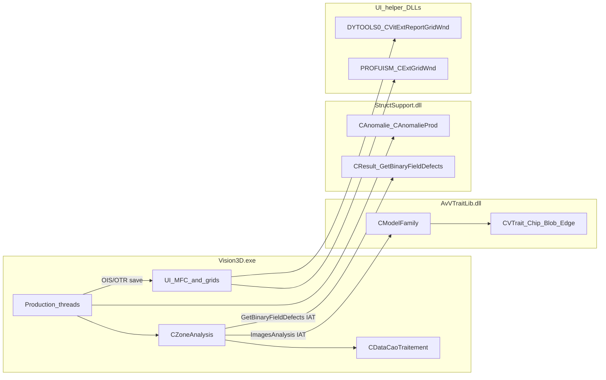

# Architecture — Vision3D 70.06.59.00

## Module map

| Module | Image base | Approx named / total funcs | Owns |
| --- | --- | --- | --- |
| Vision3D.exe | `0x140000000` | 33 534 / 131 008 | Production walk, skip list, review routing, most dialogs |
| AvVTraitLib.dll | `0x180000000` | 23 495 / 140 531 | Presence / 3D traits, `ImagesAnalysis` |
| StructSupport.dll | `0x180000000` | (import later) | Defect bitfield, anomaly RazRes / IsOk |
| DYTOOLS0.DLL | `0x180000000` | 14 500 funcs (imported) | `CVitExtReportGridWnd` click dispatcher |
| PROFUISM.DLL | `0x180000000` | 35 653 funcs (imported) | Prof-UIS grids (`CExtGridWnd`, `CExtReportGridWnd`) |

## Modes

| Mode | Entry signals | Primary classes / strings |
| --- | --- | --- |
| **Production** | `CProductionThread::*`, zone execute | `CZoneAnalysis`, `CDataCaoTraitement`, `CProdCarte`, `CMsgPanelProd` |
| **Review** | `ShouldItGoToReviewStation`, `SendPanelToReviewStation` | `CProdCarte`, OIS recorder helpers, report grids |
| **Compose / editor** | `CDocCompose::*`, wizards | CAD / TST programming |
| **Library** | `CBibliotheque`, `CModelFamily`, `CVTrait_*` | Mostly in AvVTraitLib |

Mode counts from named `Class::` symbols (heuristic, Vision3D.exe): production 204, review 168, compose 208, library 326, ui 1748, other 2162. UI count is inflated by Prof-UIS / MFC paint classes — filter those out when planning patches.

## Naming reality

PDB did **not** name many production methods as functions. They appear as:

1. Log strings: `"CZoneAnalysis::ExecuteOne_Component"`, `"CProdCarte" + "ShouldItGoToReviewStation"`, …
2. Manual renames already applied for Feature 1 (`ExecuteOne_Component` @ `0x1407368d0`, etc.)
3. External demangled imports: `DYTOOLS0.DLL::CVitExtReportGridWnd::…`

Always prefer string xref + call graph over assuming the Symbol Tree is complete.

## Data objects that cross modes

| Object | Owner | Notes |
| --- | --- | --- |
| `CDataCaoTraitement*` (CAO) | Vision3D | Skip list, production zones (`+0x5878` / count `+0x5880`) |
| Sub-panel id | component object `+0x14` | Used at stock `SkipSubPanel` call |
| `CAnomalie` / `CAnomalieProd` | StructSupport | Defect mask `+0x28`, skip cause `+0x2C` |
| Missing bit | `CResult::GetBinaryFieldDefects` | **`0x1`** |
| Card skip bit | review mask | **`0x100`**; stock `ShouldItGoToReviewStation` clears it via `0xFFFFFEFF` |

## What this atlas deliberately skips

- Cognex / cog* vision DLLs
- AlgoCore / AlgoK algorithm bodies (unless Feature work enters them)
- Full MFC / Prof-UIS paint manager trees
- Dongle / licensing code
