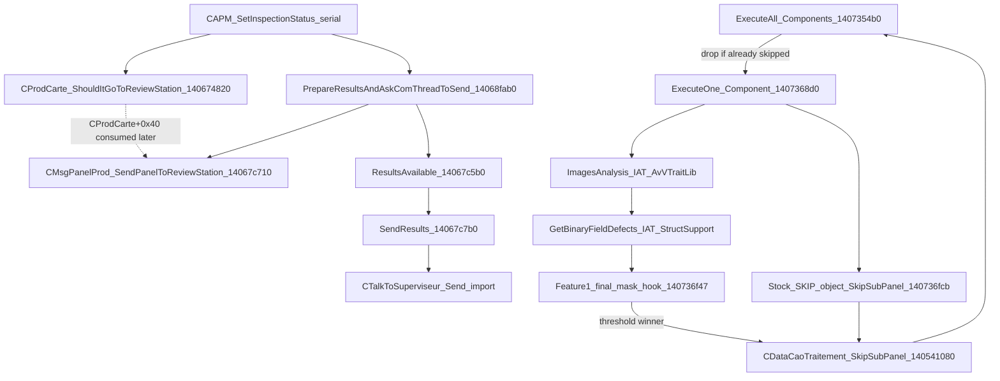

# Production flow overlay

Stock path plus Feature 1 hook sites. Addresses are **70.06.59.00** only.  
Decomps: [`decomp/ExecuteOne_Component.c`](decomp/ExecuteOne_Component.c), [`decomp/ExecuteAll_Components.c`](decomp/ExecuteAll_Components.c), [`decomp/SkipSubPanel.c`](decomp/SkipSubPanel.c), [`decomp/ShouldItGoToReviewStation_log.c`](decomp/ShouldItGoToReviewStation_log.c).

## High-level path

## Verified stock anchors

| Step | VA | Evidence |
| --- | --- | --- |
| `ExecuteAll_Components` | `0x1407354b0` | Renamed; honors skipped sub-panels |
| `ExecuteOne_Component` | `0x1407368d0`–`0x1407374e8` | Renamed |
| `ImagesAnalysis` call | `0x140736e8a` → IAT | AvVTraitLib |
| `GetBinaryFieldDefects` call | `0x140736efd` → IAT | StructSupport |
| Skip-mark gate | `TEST [rsp+0x74], 0x800001` @ `0x140736f8f` | Missing `0x1` or `0x800000` blocks mark-skip |
| Stock `SkipSubPanel` call | `0x140736fcb` | Only code call site in stock binary |
| `SkipSubPanel` body | `0x140541080` | Early-out via `IsSkippedSubPanel` |
| `IsSkippedSubPanel` | `0x14052e010` | |
| Review decision | `0x140674820` | Masks sub-panel flags with `0xFFFFFEFF` (clears card-skip `0x100`) |
| Prepare result message | `0x14068fab0` | Builds embedded panel message, copies anomalies, consumes `CProdCarte+0x40` |
| Mark panel for review | `0x14067c710` | Sets inverted `CMsgPanelProd+0x0c`; does not transmit |
| Wake communication thread | `0x14067c5b0` | Sets results-available event |
| Send image/panel messages | `0x14067c7b0` | Sends ready anomaly memory as `CMsgImage`, then `CMsgPanelProd` |
| Vision transport wrapper | `0x14064e110` | Calls imported `CTalkToSuperviseur::Send` |

The review decision and transfer are temporally separate. The serialized CAPM
commit computes `CProdCarte+0x40`; result preparation later copies that value
into the message and wakes the communication thread. Full evidence:
[`review-station-handoff.md`](review-station-handoff.md).

## Feature 1 injected sites (hardened candidate)

See [`../version.md`](../version.md). Summary:

| Site | VA | Role |
| --- | --- | --- |
| Final-mask hook | `0x140736f47` | Count Missing after stock RazRes |
| Worker handler | `0x141c98000` | Atomic claim + immediate `SkipSubPanel` |
| `SkipList_Reset` trampoline | `0x140541050` | Retire CAO context |
| Serial finalization | `0x14069b4d8` | Anomaly reconcile before review test |
| Stock-skip wrapper | `0x140736fcb` → `0x141c98c00` | Same per-CAO lock as threshold |
| Review mask widen | `0x1406748c5` | `0xFFFFFEFF` → `0xFFFFFFFF` |

## Defect semantics

- **Missing numerator bit:** `0x1` only.
- Every completed component inspection increments the denominator.
- Polarity / offset / text / joints / bridges are inspected but not Missing.
- CSV export column order (result dump, not necessarily UI order):

  `Presence/Absence test, Polarity, X, Y, Theta, Joints, Bridges, Text, …`

  Source: [`decomp/CSV_failure_mode_header.c`](decomp/CSV_failure_mode_header.c).

## Concurrency / lifecycle notes

Eight CAO-keyed contexts; 1024 sub-panel cells; table lock covers count+claim; fail-open on bad IDs / full table. Details and acceptance matrix live in `version.md` / `README.md` at repo root.
