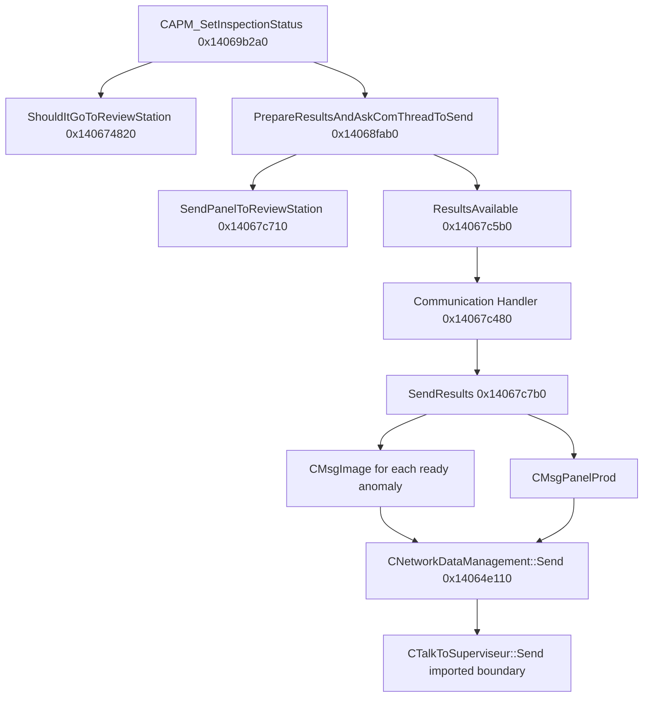

# Review-station handoff — decision, images, and panel result

**Build:** Vision3D 70.06.59.00.  
**Status:** static call path proven through the Vision3D boundary to
`CTalkToSuperviseur::Send`. The transport implementation below that imported
method is outside this map.

## Result

Vision3D does **not** hand `.ois` or `.otr` files to the review station on this
path. It sends:

1. zero or more `CMsgImage` messages whose bytes come from each eligible
   anomaly's in-memory `CMemBuffer`; then
2. one `CMsgPanelProd` message containing the panel/result model and the
   inverted send-to-repair flag.

OIS/OTR recording is a parallel filesystem feature. It shares the
`CVitImgFileRecorderHelper::Save` image-building stage, but uses different
policy bits and concrete file writers.

## Proven message path

### Ordering and synchronization

1. `CAPM_SetInspectionStatus` calls the review gate at `0x14069b4d8`.
2. It waits on the production-document semaphore at `CAO+0x3890`, builds the
   ID-result vector, and calls `PrepareResultsAndAskComThreadToSend`.
3. Preparation fills the embedded `CMsgPanelProd` at
   `CProductionDoc+0x5dc0`, calls `SendPanelToReviewStation`, then signals the
   communication object's event at `+0x40`.
4. The communication handler waits on stop/results/alarm events. Result event
   index 1 calls `SendResults` at `0x14067c56c`.
5. `SendResults` sends image messages first and the panel message last, clears
   the panel object, then releases `CProductionDoc+0x3890`.

This means the old `review -> send` atlas arrow was logical, not an immediate
call. The gate and network transfer occur in different functions and threads.

## Review decision and message fields

| Object field | Meaning | Evidence |
| --- | --- | --- |
| `CProdCarte+0x40` | send this panel to review | Written by `0x140674820`; passed by preparation |
| `CProdCarte+0xac` | panel-level anomaly | Nonzero forces `+0x40 = 1` |
| `CProdCarte+0xb8` | DWORD card/sub-panel status array | Scanned by the gate |
| `CProdCarte+0x1f8` | active array count | Loop bound |
| `CMsgPanelProd+0x0c` | inverted send-to-repair value | `0` means YES; `1` means NO |

Stock `ShouldItGoToReviewStation` tests every card status with
`0xfffffeff`, deliberately excluding bit `0x100`. The Feature 1 candidate
widens this to `0xffffffff`; that patch behavior is documented separately in
`version.md`.

`CMsgPanelProd::SendPanelToReviewStation` does not send anything. It only logs
the decision and stores the inverted value:

- route byte `0` -> message field `1` -> repair **NO**
- route byte nonzero -> message field `0` -> repair **YES**

## Image payload selection

`CProductionCommunication::SendResults` walks:

`CPanel -> each CCarteId -> each TestedObject/CAnomalie`.

An image message is sent only when all three gates pass:

- `CAnomalie+0x158 == 1` (picture ready);
- `CAnomalie+0x190`/decompiler `+400` is nonzero;
- `CAnomalie+0x198` is nonzero.

For each eligible anomaly it:

1. constructs `CMsgImage` and sets message kind `0x10000`;
2. adds panel ID, face, topology, date, and card ID;
3. obtains bytes and length from `CMemBuffer` at `CAnomalie+0x188`;
4. calls `CNetworkDataManagement::Send` (`0x14064e110`);
5. deletes the anomaly buffer after the call.

The exact private layout used by `CMsgImage` to serialize the adjacent
buffer/length locals is decompiler-derived and remains unnamed, but the data
source, eligibility fields, send call, and post-send deletion are direct
evidence.

After all image messages, `SendResults` sends the complete `CMsgPanelProd`.
The success log is:

`Msg Panel <%s> and %d image(s) sent to supervisor.`

## Network boundary and destination

`0x14064e110` is a Vision3D wrapper named by its own log scope as
`CNetworkDataManagement::Send`. It calls imported
`CTalkToSuperviseur::Send` and records supervisor error replies. This import is
the first proven transport boundary in the mapped executable; socket framing,
protocol, retries, and the remote endpoint live below that boundary.

`CNetworkDataManagement::GetReviewStation` (`0x14064d6d0`) is **not** in the
`SendResults` call chain. It selects one of two configured station-name strings
at network-object offsets `+0xd0` and `+0xd8` by lane and is called by
`0x140697200`, a conveyor/routing path. Therefore:

- result/image messages go to the configured **supervisor connection**;
- the review-station name is used for physical lane/station routing;
- the current evidence does not show Vision3D opening a direct file or socket
  connection to that station name.

## Recorder dispatch and filesystem paths

`CVitImgFileRecorderHelper::Save` (`0x1406e79c0`) first builds an in-memory
`CVitImgFile`, then dispatches by the policy mask (`param_3`):

| Mask | Action |
| --- | --- |
| `0x1` | call `SaveOIS` |
| `0x2` | call `SaveOTR` |
| `0x4` | retain encoded bytes in `CAnomalie+0x188`, set `+0x158 = 1` |
| `0x8` | create thumbnail |
| `0x10` | retain encoded bytes without setting the ready flag |
| `0x14` | common test for retaining the memory payload |

The normal `CZoneAnalysis::PictureSave` path (`0x140737b20`) computes
`param_3` as either `0` or `0x4`, then calls `Save` with image type `6`.
Therefore its review payload path is memory-only: it does not select the
`0x1` OIS or `0x2` OTR filesystem branches.

### OIS

`SaveOIS` (`0x1406e7d90`) uses the context base directory at `+0x40`, appends
the sanitized optional subdirectory at `+0x180`, creates the directory, and
writes with `CBlockFile::DuplicateToFile`.

Filenames:

- `%s_%s_%i_%s.ois`
- `%s_%s_%i_3D_%s.ois`

Type `8` is governed by `Production / Save Foreign Materials OIS`; only types
`1` and `8` are accepted by this helper.

### OTR

`SaveOTR` (`0x1406e8220`) obtains its base from
`CTest::GetOTR_ProdFileDirectory`, appends the sanitized optional subdirectory,
and initially writes with `CBlockFile::DuplicateToFile`. It reopens the OTR and
may add model-library data for image type `1`.

Filenames:

- `%s_%s_%i_%s.otr`
- `%s_%s_%i_3D_%s.otr`

If the first sanitized component is empty and image type is `2`, it substitutes
`PASTE`.

`SaveOTR_OISFileForMacro` (`0x1406e87c0`) is another filesystem utility. It
writes the anomaly's in-memory buffer to an `.ois` file under the OTR
directory using `CFile::Open`/`CFile::Write`; it is not called by the normal
`Save` dispatcher.

### Other OIS pipeline

`CDataCaoTraitement::SaveOISFile_FiducialOrSkipOdIdCode` (`0x14053c440`) is a
separate fiducial/ID-code recording path. Its callers (`0x1405db220`,
`0x14069e730`, and `0x14069fe60`) do not place it in the communication-thread
handoff.

## Failure behavior

- Missing communication thread: preparation logs
  `m_pCommunicationThread == 0.`, cleans its temporary vector, and returns
  failure without signaling a transfer.
- Network send failure: `SendResults` logs `oNetwork.Send(%s) failed.`.
  Image iteration continues; the panel send is still attempted.
- The final `"... sent to supervisor"` log is emitted after the panel send
  attempt even when that call returned failure. It is not sufficient proof of
  successful delivery by itself.
- Image buffer: deleted immediately after its image send attempt.
- Panel/semaphore: panel is cleared and the semaphore is released after the
  batch.
- OIS/OTR write failures are local recorder failures and do not gate the
  communication-thread message transfer in the proven call graph.

## Evidence and confidence

| Claim | Confidence | Basis |
| --- | --- | --- |
| Gate -> preparation -> event -> handler -> send ordering | High | direct CALL xrefs and decompilation |
| Image messages precede panel message | High | direct control flow in `0x14067c7b0` |
| Review image bytes originate in anomaly memory | High | `CMemBuffer::GetBuffer` and subsequent send/delete |
| Normal picture path uses memory mask `0x4`, not OIS/OTR bits | High | direct call arguments in `0x140737b20` |
| `.ois`/`.otr` files are not sent by this path | High for Vision3D | no path/file inputs in send chain; memory message path is explicit |
| On-wire protocol and final socket endpoint | Unknown | below imported `CTalkToSuperviseur::Send` |
| Runtime ordering on Bronco | Not checked | no production log files are present in this repository |

Machine-readable evidence: `review_station_handoff.json`. Relevant
decompilations are under `decomp/`, especially
`PrepareResultsAndAskComThreadToSend.c`,
`ProductionCommunication_SendResults.c`, `Network_Send.c`,
`Recorder_Save.c`, `SaveOIS_helper.c`, `Recorder_SaveOTR.c`, and
`Zone_SaveOIS_callsite.c`.
