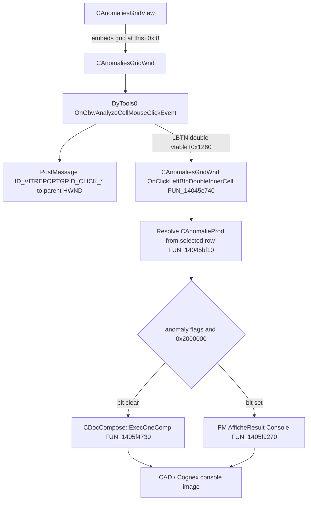

# Review UI — failure-mode table → component image

**Status:** click path mapped through `DyTools0` + `ProfUISm` + `Vision3D` `CAnomaliesGridWnd`.  
Column-specific Missing/Text vs Deviation failure is **not fully proven**; open gates are identified.  
**Do not patch** until a Bronco column index ↔ anomaly-slot check confirms the failing gate.

Station report (Bronco): clicking a failure mode in the table usually opens the component image. **Deviation worked; Missing and Text did not.**

## Proven click path (70.06.59.00)

### Module roles

| PE | Role in this path | Evidence |
| --- | --- | --- |
| `DyTools0.dll` | `CVitExtReportGridWnd::OnGbwAnalyzeCellMouseClickEvent` @ `0x1801153d0` posts registered msgs + dispatches `OnClick*` virtuals | Decomp `maps/decomp/DyTools0_click_1801153d0.c` |
| `ProfUISm.dll` | Base `CExtReportGridWnd::OnGbwAnalyzeCellMouseClickEvent` @ `0x18038e680` — right-click / tree only; **not** the image open | `maps/decomp/ProfUISm_click_18038e680.c` |
| `Vision3D.exe` | `CAnomaliesGridWnd` overrides left-double @ vtable+`0x1260` → `FUN_14045c740` | `maps/Vision3D_anomalies_vtable.json`, `maps/decomp/Vision3D_anomvt_14045c740.c` |

DLL copies used for analysis (not live `C:\VIT`):

| File | SHA-256 | Notes |
| --- | --- | --- |
| `v3d_files_/DyTools0.dll` | `f5421b55…05767e` | 14 500 funcs analyzed in `V3D_SKIP` |
| `v3d_files_/ProfUISm.dll` | `7292f995…0d5036a` | 35 653 funcs analyzed |

### Key Vision3D addresses

| Item | VA | Notes |
| --- | --- | --- |
| `CAnomaliesGridWnd` ctor | `0x140453090` | Sets `CAnomaliesGridWnd::vftable`; enables flag at `this+0x1a1c` |
| `CAnomaliesGridView` ctor | `0x1404e17f0` | Embeds grid at `this+0xf8` |
| Left-double open handler | `0x14045c740` | Returns 1 on success / 0 on soft fail |
| Row → `CAnomalieProd` | `0x14045bf10` | Tree at `grid+0x344`; needs selected report item |
| `CDocCompose::ExecOneComp` | `0x1405f4730` | Opens component by topo/OCV name + CAD id |
| FM console display | `0x1405f9270` | Path when anomaly `flags & 0x2000000` |
| Primary vftable | `0x140dd88e8` | `OnGbwAnalyze…` still DyTools0 IAT @ +`0x7d8` |

Raw dumps: `Vision3D_anomalies_vtable.json`, `Vision3D_anom_open_path.json`, `DyTools0_onclick_min.json`, `ProfUISm_click_deep.json`.

## What the open handler checks

`FUN_14045c740` soft-fails (returns 0, no image) when any of:

1. `FUN_14045bf90()` is null **or** `FUN_1405ddc30(doc)` says doc not ready  
2. `FUN_14045bf10(grid)` cannot map the selected row to a `CAnomalieProd`  
3. Normal path: topo / OCV name → `CDataCao::GetObjectA` returns null  
4. `ExecOneComp` cannot match CAD line / inspected element (message box `0xd1b` in several failure arms)

Branching after anomaly is found:

- `flags & 0x2000000` → foreign-material console (`FUN_1405f9270`)  
- else if OCV reader string non-empty → use that name (mode 2)  
- else → use `_csTopo` (mode 1) → `ExecOneComp`

**Important:** this handler is driven by the **selected row’s anomaly**, not by an explicit column index in the decomp. Column effects are therefore indirect (selection / which anomaly slot the cell represents / whether topo vs OCV is populated).

## Missing / Text / Deviation (updated hypotheses)

| UI word | Likely binary meaning | Why click may fail |
| --- | --- | --- |
| **Missing** | Presence/Absence (`flags` bit `0x1` in production) | Row anomaly may lack topo/OCV CAD linkage → `GetObjectA` / `ExecOneComp` fail |
| **Text** | OCR / text fault (`Text` CSV column) | Same; may prefer `_csOCV_Reader` and fail if empty |
| **Deviation** | X/Y/Theta position columns | Usually has resolvable topo / CAD component → `ExecOneComp` succeeds |

Lower priority:

- OIS archive policy (still plausible for other viewers; this path is `CDocCompose` / console, not `SaveOIS`)  
- Feature 1 skip masks (unlikely to explain column-selective click alone)

## Registered messages (secondary)

`DyTools0` also `PostMessageA`s `ID_VITREPORTGRID_CLICK_LBTN{UP,DWN,DBL}_INNER` (and M/R variants) to the grid parent HWND.  
`Vision3D.exe` registers the same strings into many per-TU `DAT_` globals, but **no absolute message-map pointer hits** and **no READ xrefs** beyond the inits were found. Treat parent WM consumers as **unproven / possibly dead**. Primary open for left-double is the virtual override above.

Single-click LBTN up/down virtuals remain DyTools0 stubs (return false) on `CAnomaliesGridWnd`; if the station opens on single-click, that still needs a parent WM consumer or selection-change side path.

## Related production → review handoff

| Function | VA | Role |
| --- | --- | --- |
| `CProdCarte::ShouldItGoToReviewStation` | `0x140674820` | Review gate; masks out `0x100` |
| `CProductionDoc::PrepareResultsAndAskComThreadToSend` | `0x14068fab0` | Builds panel model and wakes communication thread |
| `CMsgPanelProd::SendPanelToReviewStation` | `0x14067c710` | Sets inverted repair yes/no field; no I/O |
| `CProductionCommunication::SendResults` | `0x14067c7b0` | Sends in-memory image messages, then panel message |
| `CNetworkDataManagement::Send` | `0x14064e110` | Wrapper over imported `CTalkToSuperviseur::Send` |
| Feature 1 review widen | `0x1406748c5` | Includes skip bit so skip-only panels stop |

The review transport uses in-memory anomaly image buffers, not the `.ois` or
`.otr` files. See [`review-station-handoff.md`](review-station-handoff.md).

## Next concrete atlas tasks

- [x] Import DYTOOLS0 + PROFUISM; decompile click dispatcher  
- [x] Identify Vision3D override that opens the component (`FUN_14045c740`)  
- [ ] Confirm Bronco: single-click vs double-click; exact column headers  
- [ ] Trace how Missing/Text rows populate `_csTopo` / `_csOCV_Reader` / flag `0x2000000` vs Deviation  
- [ ] Map `CAnomaliesGridView` / `CDocCompose` selection path for single-click if needed  
- [ ] Only then consider a patch
